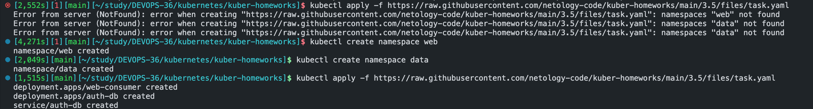
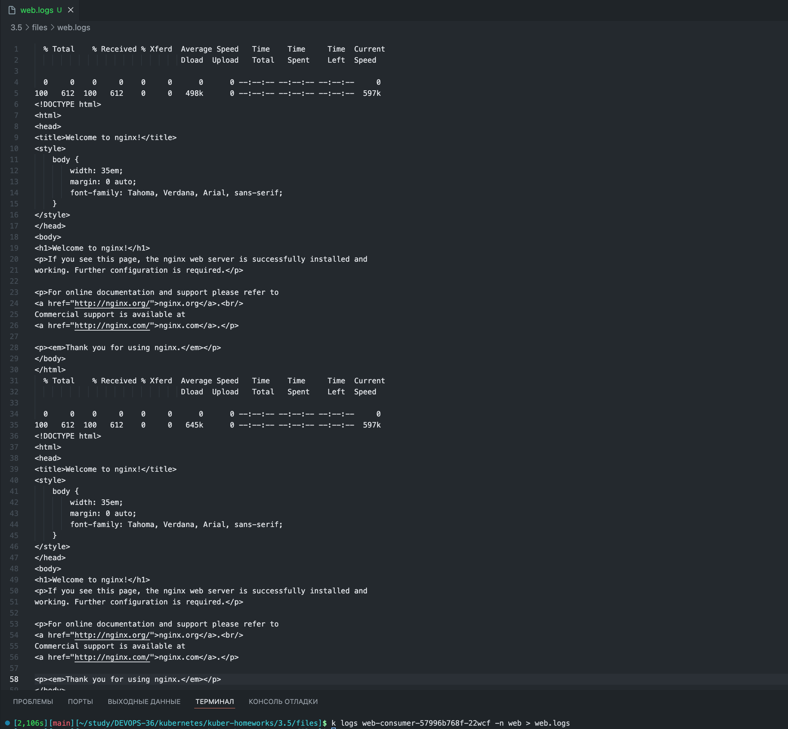
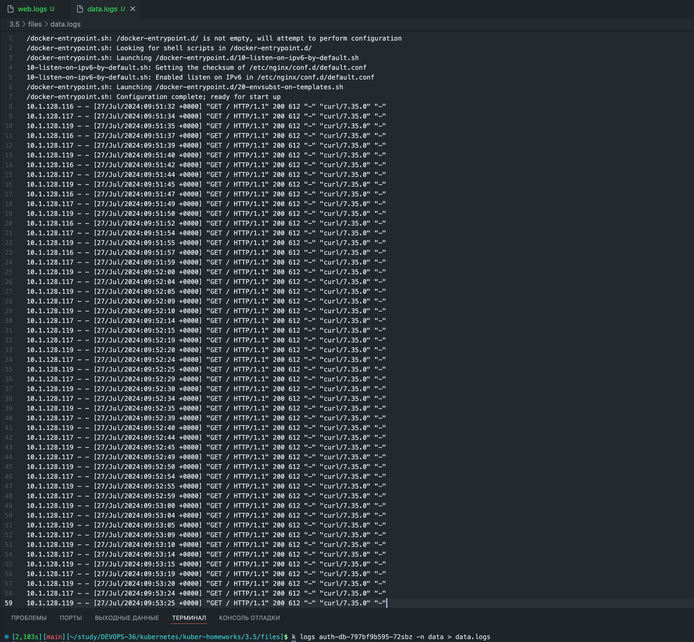

# Домашнее задание к занятию Troubleshooting

### Цель задания

Устранить неисправности при деплое приложения.

### Чеклист готовности к домашнему заданию

1. Кластер K8s.

### Задание. При деплое приложение web-consumer не может подключиться к auth-db. Необходимо это исправить

1. Установить приложение по команде:
```shell
kubectl apply -f https://raw.githubusercontent.com/netology-code/kuber-homeworks/main/3.5/files/task.yaml
```
2. Выявить проблему и описать.
3. Исправить проблему, описать, что сделано.
4. Продемонстрировать, что проблема решена.

Выполнение:
Запускаем монифест:
```shell
kubectl apply -f https://raw.githubusercontent.com/netology-code/kuber-homeworks/main/3.5/files/task.yaml
```
Ошибка - создаем неймспейсы:
```shell
kubectl create namespace web
kubectl create namespace data
```
Повторно запускаем монифест:
```shell
kubectl apply -f https://raw.githubusercontent.com/netology-code/kuber-homeworks/main/3.5/files/task.yaml
```

  


Основной проблемой в конфигурации является то, что Pod в `namespace: web` пытается выполнить `curl` к `auth-db`, который находится в `namespace: data`, но не существует подходящего DNS-имени, которое будет разрешено в `web` для `auth-db` в `data`. 

В Kubernetes, чтобы Pod в одном namespace мог обратиться к Service в другом namespace, необходимо использовать полное доменное имя (FQDN) для сервиса, которое включает namespace.

### Исправленный манифест:

Скачал локально манифест в директорию [files](./files/task.yaml)
curl -O https://raw.githubusercontent.com/netology-code/kuber-homeworks/main/3.5/files/task.yaml
Внес изменения `while true; do curl auth-db.data.svc.cluster.local; sleep 5; done`
Запустил повтро `kubectl apply -f task.yaml`

### Объяснение исправлений:

1. **Использование FQDN для `auth-db`**:
   - В `web-consumer` Deployment, команда `curl auth-db` заменена на `curl auth-db.data.svc.cluster.local`, чтобы использовать полное доменное имя для доступа к сервису `auth-db` в `namespace: data`.

Теперь, когда `web-consumer` Pod выполнит `curl`, он будет использовать правильное DNS-имя для доступа к сервису `auth-db`, который находится в `data` namespace.

Проверяем логи подов:

  
  


### Правила приёма работы

1. Домашняя работа оформляется в своём Git-репозитории в файле README.md. Выполненное домашнее задание пришлите ссылкой на .md-файл в вашем репозитории.
2. Файл README.md должен содержать скриншоты вывода необходимых команд, а также скриншоты результатов.
3. Репозиторий должен содержать тексты манифестов или ссылки на них в файле README.md.
